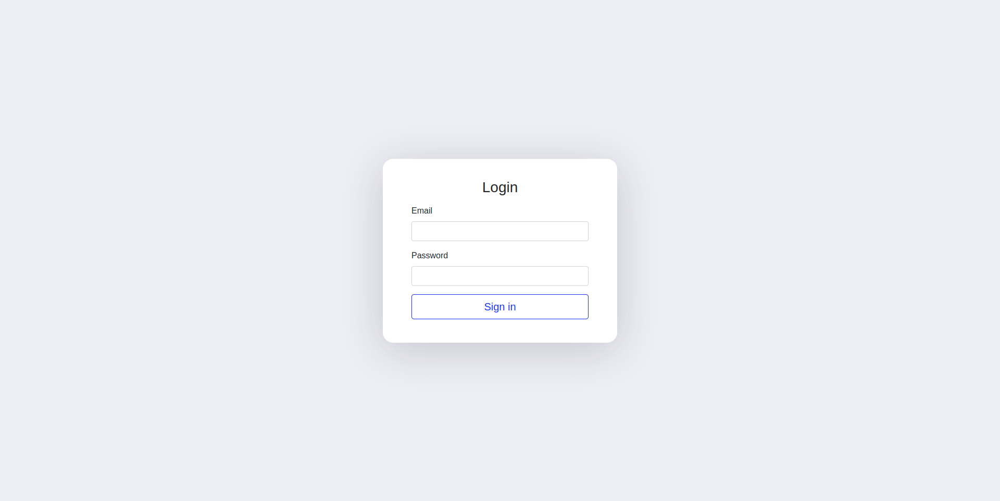

## PHP Login Template Generator for Linux
### NginX | MySQL | PHP | Bootstrap UI | SwiftMailer
[](https://opensource.org/licenses/MIT)

<br></br>
### Base Template Structure
```
\-- php-user-authentication
  |-- config
      |--- db.php
  |-- controllers
      |--- login.php
      |--- register.php
      |--- user_activation.php
  |-- css
      |--- style.css
  |-- lib
      |--- 3rd party plugins
  |-- dashboard.php
  |-- header.php
  |-- index.php
  |-- logout.php
  |-- signup.php
  |-- user_verification.php
```

#### To build & configure a PHP site Login system run the following command at the root of the project repsitory and follow instructions.
```
./BUILD.sh
```
#### test with the browser:
```
http://yourIP_or_domain/index.php
```
#### test via CLI:
```
curl -I http://yourIP_or_domain/index.php
```


